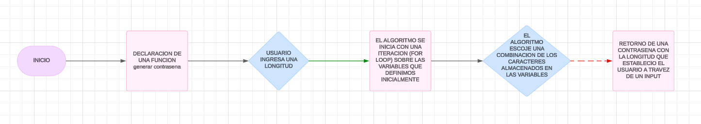

# PROYECTO INTEGRADOR

## Datos del estudiante

- **Nombre:** Jhandry Paul Santin Ortega
- **Materia:** Logica de Programación
- **Carrera:** Ingeniería en Ciberseguridad
- **Nombre del proyecto:** Generador de Contraseñas
- **Pofesora:** Ing. Monica Salazar
- **Semestre:** 1
- **Email de contacto:** jhsantinor@uide.edu.ec

## Descripción del proyecto

Este es un generador de contraseñas que utiliza random de la libreria standar de Python. Estas se contruyen mediante la combinacion de caracteres guardados previamente en las listas. El propósito de esta aplicación es proporcionar una contrasena de longitud predefinida por el usuario.

## Requisitos

Asegúrate de tener Python instalado en tu sistema. Este código es compatible con Python 3.x.


## Uso

El generador de contraseñas está implementado en el siguiente código:

```python
def generar_contrasena(longitud): 
    contrasena = "" 

    for dato in range(longitud): 

        tipo = random.randint(1,3) 

        if tipo == 1:
            contrasena  += random.choice(uno)
        elif tipo == 2:
            contrasena += random.choice(dos)
        elif tipo == 3:
            contrasena += random.choice(tres)

    return contrasena
```

### Puedes viasualizar el diagrama de flujo que describe el proceso del proyecto con esta imagen adjunta:




### Recursos

[Video Tutorial]()

[Diapositivas]()
